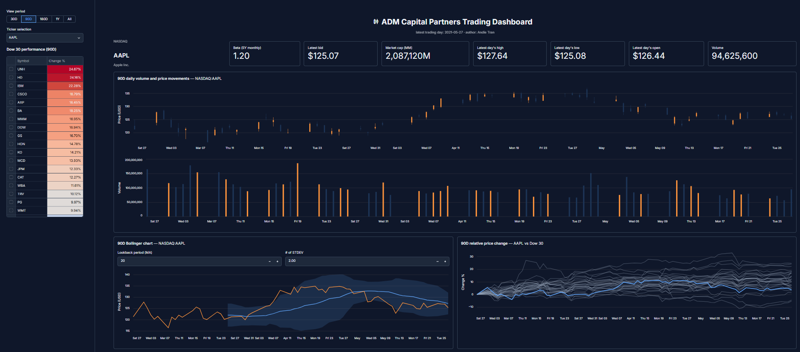
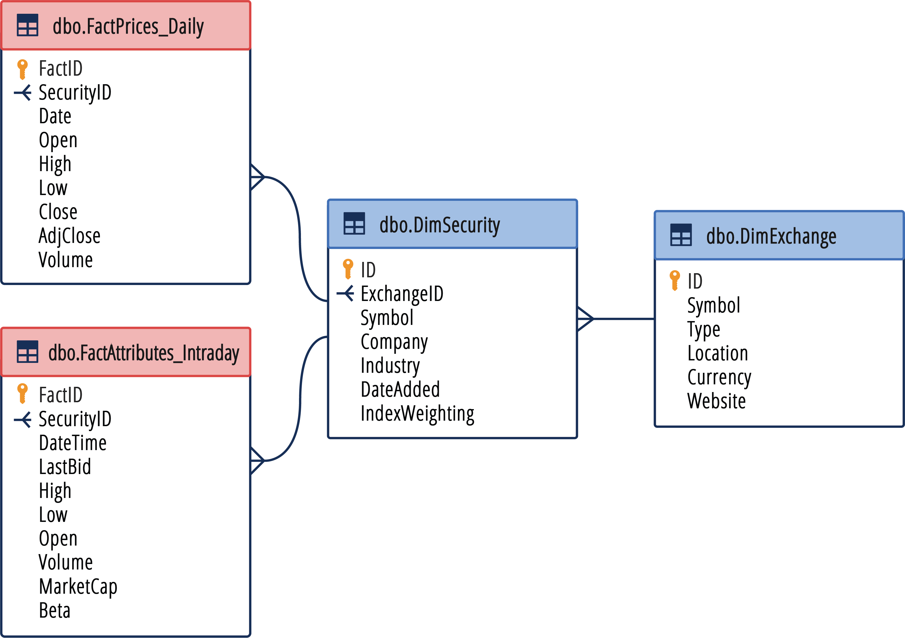
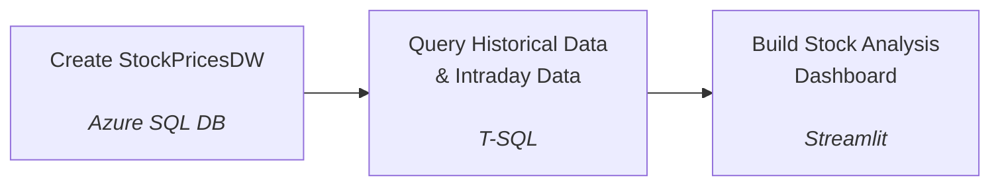

# Project Summary

## Business Overview

ADM Capital Partners tracks daily and intraday pricing for a portfolio of listed securities across multiple exchanges. Analysts need a single, query-friendly data warehouse that joins price history to security and exchange reference data, so they can build performance, volatility, and market-cap analyses without re-deriving lookups every time.

## Aim

Design and create a database, then load data from the CSV files into it. Model stock pricing data as a star schema (fact tables for daily and intraday prices, dimension tables for securities and exchanges), and write the SQL required to source clean, joined datasets for downstream analysis.Finally, build a trading analysis dashboard.

## Dashboard Preview



**Live version:** [trading-dashboard-by-andie-tran.streamlit.app](https://trading-dashboard-by-andie-tran.streamlit.app/)

## Dataset Description

Data is provided as CSV extracts under [StockPricesDW/](StockPricesDW/), one file per warehouse table:

- **dimSecurity.csv** — `ID`, `Symbol`, `Company`, `Industry`, `DateAdded`, `IndexWeighting`, `ExchangeID`
- **dimExchange.csv** — `ID`, `Symbol`, `Type`, `Location`, `Currency`, `Website`
- **FactPrices_Daily.csv** — `FactID`, `Date`, `Open`, `High`, `Low`, `Close`, `AdjClose`, `Volume`, `SecurityID`
- **FactAttributes_Intraday.csv** — `FactID`, `DateTime`, `LastBid`, `High`, `Low`, `Open`, `Volume`, `MarketCap`, `Beta`, `SecurityID`

Full schema and relationships are shown in the ERD above.

The dashboard reads from [Datasets/](Datasets/) — `HistoricalData.csv` and `IntradayData.csv` — pre-joined copies of the two SQL query results, regenerated from the CSV extracts by [Python Scripts/generate_datasets.py](Python%20Scripts/generate_datasets.py).

## ERD



## Approach

### Trading Analysis Dashboard - Case Study Approach



1. Create the `StockPricesDW` database in Azure SQL Database, and load the daily and intraday fact tables alongside the security and exchange dimension tables into it.
2. Query to retrieve `HistoricalData` and `IntradayData`: join `FactPrices_Daily`/`FactAttributes_Intraday` to `dimSecurity` and `dimExchange` on their respective keys to resolve company, symbol, industry, and exchange for each record ([SQL Query - Historical Data.sql](SQL%20Queries/SQL%20Query%20-%20Historical%20Data.sql), [SQL Query - Intraday Data.sql](SQL%20Queries/SQL%20Query%20-%20Intraday%20Data.sql)).
3. Build a stock analysis dashboard with Streamlit ([Dashboard/streamlit_app.py](Dashboard/streamlit_app.py)), using the `HistoricalData` and `IntradayData` result sets as its data source.

## Tech Stack

- **Language:** T-SQL (Microsoft SQL Server dialect), Python
- **Database:** Azure SQL Database
- **Dashboard:** Streamlit, Altair, pandas
- **Data:** CSV-based star schema (2 fact tables, 2 dimension tables)

## Setup

```bash
pip install -r "Dashboard/requirements.txt"
python -m streamlit run Dashboard/streamlit_app.py
```


## Key Learning Takeaways

- Structuring stock pricing data as a star schema separates fast-changing fact data (prices) from slow-changing reference data (securities, exchanges).
- Daily and intraday prices are modeled as separate fact tables since they have different grains (per-day vs. per-minute) and different attributes.
- Consistent `INNER JOIN` patterns against dimension tables keep queries reusable across both fact tables.


<!-- CONTACT -->
## Contact

Andie Tran - [Linkedin](https://www.linkedin.com/in/andietranofficial/)


<p align="right">(<a href="#readme-top">back to top</a>)</p>