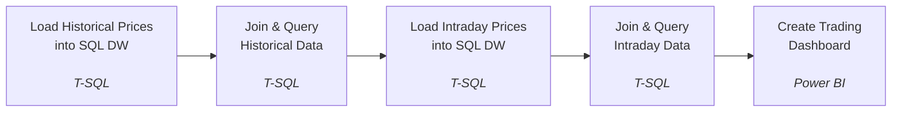

# SQL Case Study Training Materials

## Architecture

## Business Overview

ADM Capital Partners tracks daily and intraday pricing for a portfolio of listed securities across multiple exchanges. Analysts need a single, query-friendly data warehouse that joins price history to security and exchange reference data, so they can build performance, volatility, and market-cap analyses without re-deriving lookups every time.

## Aim

Design and create a database, then load data from the CSV files into it. Model stock pricing data as a star schema (fact tables for daily and intraday prices, dimension tables for securities and exchanges), and write the SQL required to source clean, joined datasets for downstream analysis.

## Dataset Description

Data is provided as CSV extracts under [StockPricesDW/](StockPricesDW/), one file per warehouse table:

- **dimSecurity.csv** — `ID`, `Symbol`, `Company`, `Industry`, `DateAdded`, `IndexWeighting`, `ExchangeID`
- **dimExchange.csv** — `ID`, `Symbol`, `Type`, `Location`, `Currency`, `Website`
- **FactPrices_Daily.csv** — `FactID`, `Date`, `Open`, `High`, `Low`, `Close`, `AdjClose`, `Volume`, `SecurityID`
- **FactAttributes_Intraday.csv** — `FactID`, `DateTime`, `LastBid`, `High`, `Low`, `Open`, `Volume`, `MarketCap`, `Beta`, `SecurityID`

Full schema and relationships are shown in the ERD above.

## Approach

### Stock Analysis Dashboard - Case Study Approach

1. Load the daily and intraday fact tables alongside the security and exchange dimension tables into a SQL database.
2. Join `FactPrices_Daily` to `dimSecurity` and `dimExchange` on their respective keys to resolve company, symbol, industry, and exchange for each historical price record ([SQL Query - Historical Data.sql](SQL%20Queries/SQL%20Query%20-%20Historical%20Data.sql)).
3. Join `FactAttributes_Intraday` to the same dimensions to resolve company and exchange context for each intraday tick ([SQL Query - Intraday Data.sql](SQL%20Queries/SQL%20Query%20-%20Intraday%20Data.sql)).
4. Use the resulting joined result sets as the source for downstream reporting and analysis.

## Tech Stack

- **Language:** T-SQL (Microsoft SQL Server dialect)
- **Data:** CSV-based star schema (2 fact tables, 2 dimension tables)

## Key Learning Takeaways

- Structuring stock pricing data as a star schema separates fast-changing fact data (prices) from slow-changing reference data (securities, exchanges).
- Daily and intraday prices are modeled as separate fact tables since they have different grains (per-day vs. per-minute) and different attributes.
- Consistent `INNER JOIN` patterns against dimension tables keep queries reusable across both fact tables.

## Pending Work

- Build a Power BI dashboard for stock analysis (to be updated).
